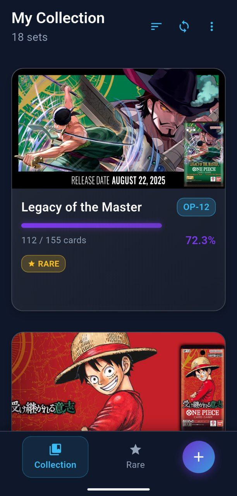
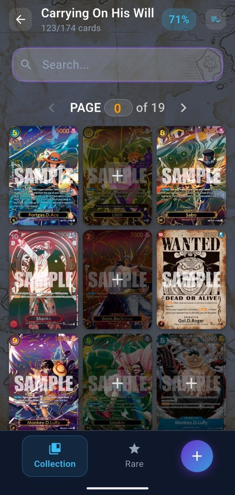
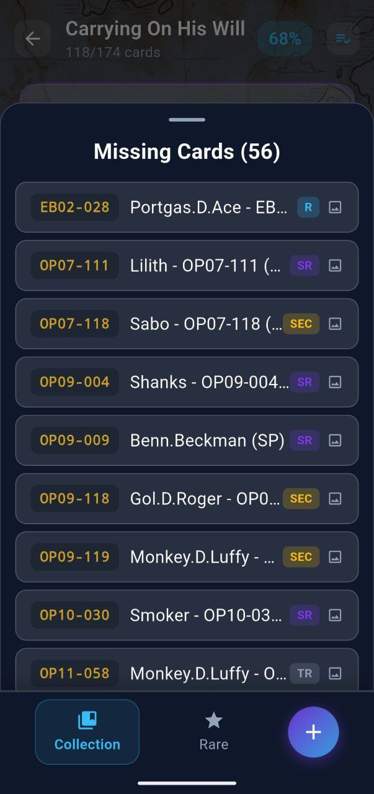
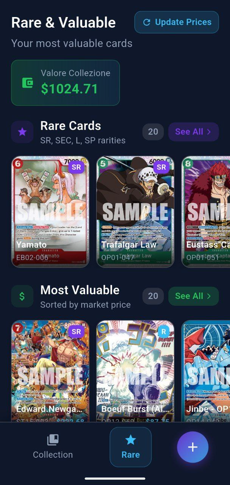
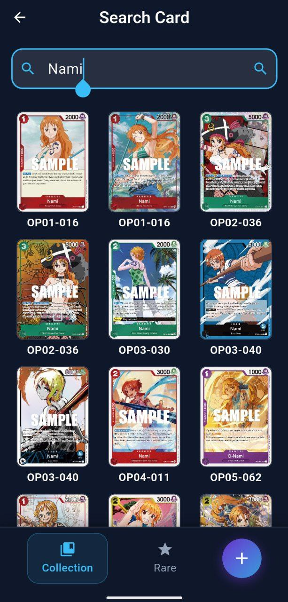
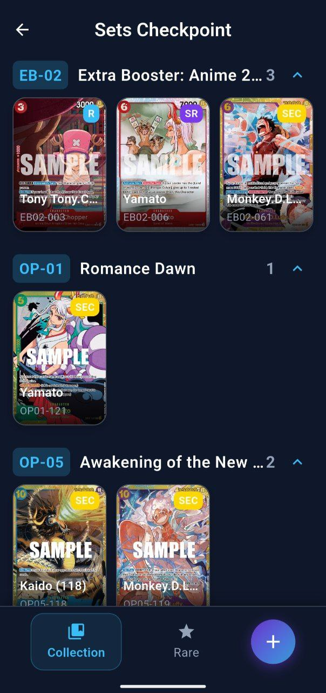
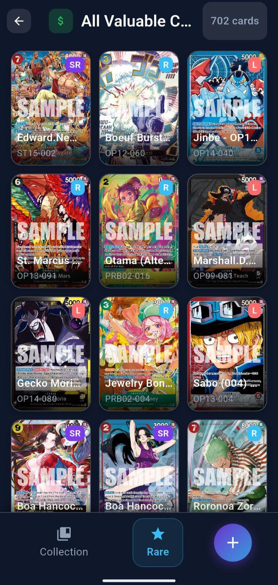

# One Piece Collector App

A sophisticated Flutter application designed for One Piece Trading Card Game collectors. This app have a comprehensive database to manage collections, track market values, and organize cards efficiently.

## Application Overview

The application is structured into several key areas allowing users to browse sets, track specific rare cards, calculate collection value in real-time, and add new cards via manual entry or camera scanning.

### Pages & Features

#### 1. Home Page (Collection Overview)
The central hub of the application. Here, users can view all released card sets with visual completion indicators.
- **Features**: Sort sets by release date or completion percentage, Sync data from API, Import/Export collection (JSON).
- **Navigation**: Access to Sets Checkpoint and Global Search.

#### 2. Set Detail Page
(Accessed by tapping a set in Home)
Displays all cards within a specific set. Allows users to toggle collected status and view individual card details.

#### 2.5 Show missing cards in a set
A feature within the Set Detail Page that highlights which cards are missing from the user's collection, making it easier to identify gaps and prioritize acquisitions.

#### 3. Rare & Valuable Dashboard
A dedicated dashboard for the "Crown Jewels" of your collection.
- **Features**: Displays total collection market value, highlights high-rarity cards (SEC, SR, SP, L), and lists top cards by market price.
- **Functionality**: Pull to refresh market prices.

#### 4. Search Card
A global search tool to find any card in the database by name or code, regardless of ownership status.

#### 5. Sets Checkpoint
A compact, list-based view of the collection organized by set, useful for quick inventory checks.

#### 6. Rare & Valuable Lists
Detailed grid views for browsing all rare cards or all valuable cards in the collection.

---

## Legal & Copyright

This project is a fan-made application and is not affiliated with, endorsed, sponsored, or specifically approved by Bandai or the creators of One Piece.

**ONE PIECE CARD GAME**  
@Eiichiro Oda/Shueisha @Eiichiro Oda/Shueisha, Toei Animation
